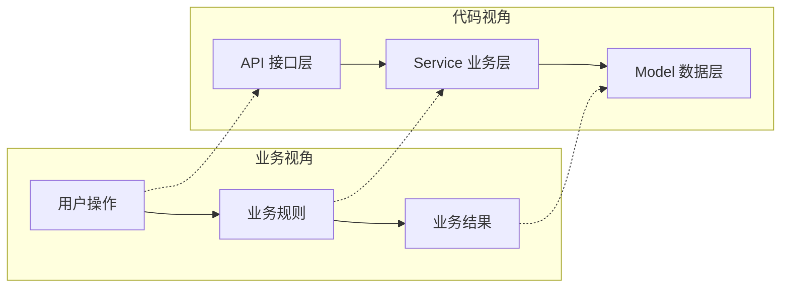

## 业务流程理解模板

帮自学者从业务视角理解项目，建立"业务 → 代码"的映射关系。

---

### 业务理解三步法

**第一步：搞清楚"这个项目服务谁"**
- 用户是谁？（C 端求职者 / B 端管理员 / 内部系统）
- 用户用它做什么？（核心场景 2-3 个）
- 用户最常做的操作是什么？

**第二步：搞清楚"核心业务流程"**
- 用「用户故事」描述：作为 XXX，我想要 XXX，以便 XXX
- 画出业务流程图（纯业务视角，不涉及代码）
- 标注"正常流程"和"异常流程"

**第三步：搞清楚"业务概念 → 代码模块"的映射**
- 每个业务概念对应哪个代码模块？
- 每个用户操作对应哪个接口？
- 业务规则写在哪一层（一般在 service 层）？

---

### 业务场景描述模板

```
## 场景名称：{场景名}

### 用户故事
> 作为 {角色}，我想要 {操作}，以便 {目的}

### 前置条件
- {条件1}

### 正常流程
1. 用户 {操作1}
2. 系统 {响应1}
3. ...
5. 结果：{最终结果}

### 异常情况
| 异常 | 系统行为 | 用户看到什么 |
|------|---------|-------------|

### 对应代码（逐跳标注）
| 业务步骤 | 代码位置 | 关键函数 |
|---------|---------|---------|
| {步骤1} | `app/api/...` | `{函数名}` |
| {步骤2} | `app/services/...` | `{函数名}` |
| {步骤3} | `app/models/...` | `{表/字段}` |
```

---

### 业务术语表模板

| 业务术语 | 大白话解释 | 对应代码中的命名 | 所在模块 |
|---------|-----------|----------------|---------|
| 采分点 | 评分时要点到的关键得分项 | `key_points` | 题库/评分 |
| 候选人画像 | 从简历提炼的技能/经验标签集 | `candidate_profile` | 岗位匹配 Agent |

---

### 业务-代码映射图模板



---

### 常见业务模式识别

| 业务模式 | 特征 | 代码中的体现 | 理解要点 |
|---------|------|-------------|---------|
| CRUD | 增删改查 | api/service/model 三层 | 最基础，先看懂这个 |
| 状态机 | 有明确状态流转（如简历 pending→completed） | 状态字段 + 转换规则 | 画出状态图就懂了 |
| 异步任务 | 一个操作触发耗时后续动作 | Celery 任务 / 后台 job | 找到"谁丢任务、谁取任务执行" |
| 流程编排 | 多步骤按顺序执行 | Agent 工具链 / pipeline | 找到步骤列表和执行顺序 |
| 检索增强（RAG） | 答题前先查资料 | embedding + 向量召回 + 拼 prompt | 关注召回策略和兜底 |
| 资格/匹配 | 判断谁更合适 | 画像 + 模板库 + 打分 | 找到打分逻辑和阈值 |

---

### 理解业务的 6 个快捷方式

1. **看接口定义 + Schema** — 接口名和字段名往往直接反映业务含义（Python 项目看 `api/` 路由 + `schemas/`）
2. **看错误码/异常定义** — 异常列表就是"所有可能出错的情况"清单
3. **看配置文件** — 配置项名称暗示了可调整的业务参数
4. **看 Prompt 内容** — AI 项目里，system prompt 往往写满了业务规则（如评分标准、画像字段）
5. **看 git commit message** — 提交信息常包含需求背景
6. **看管理后台功能** — 管理端（backoffice）的功能 = 业务的全貌（题库、岗位模板、知识库都在这维护）
